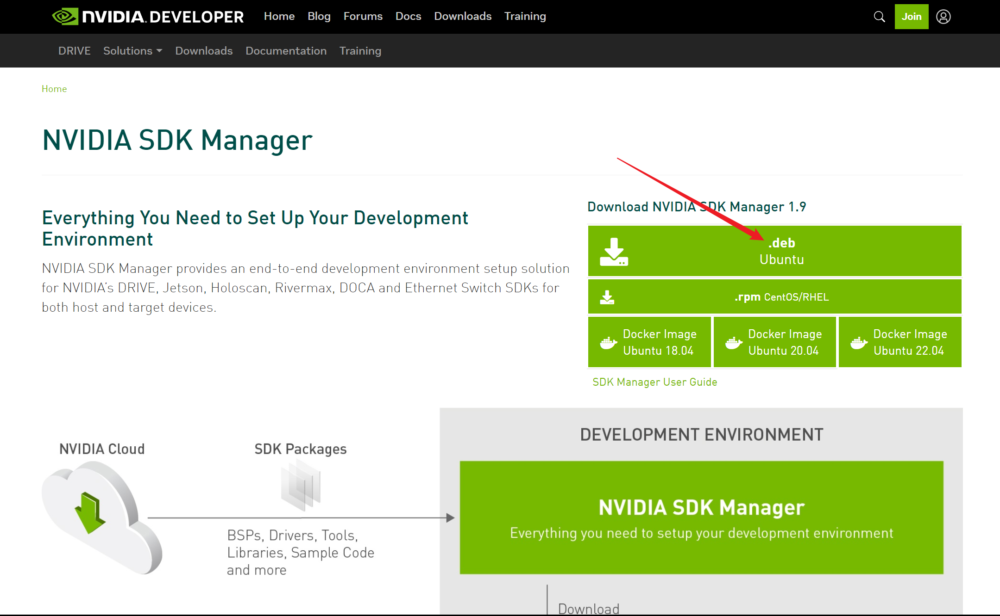
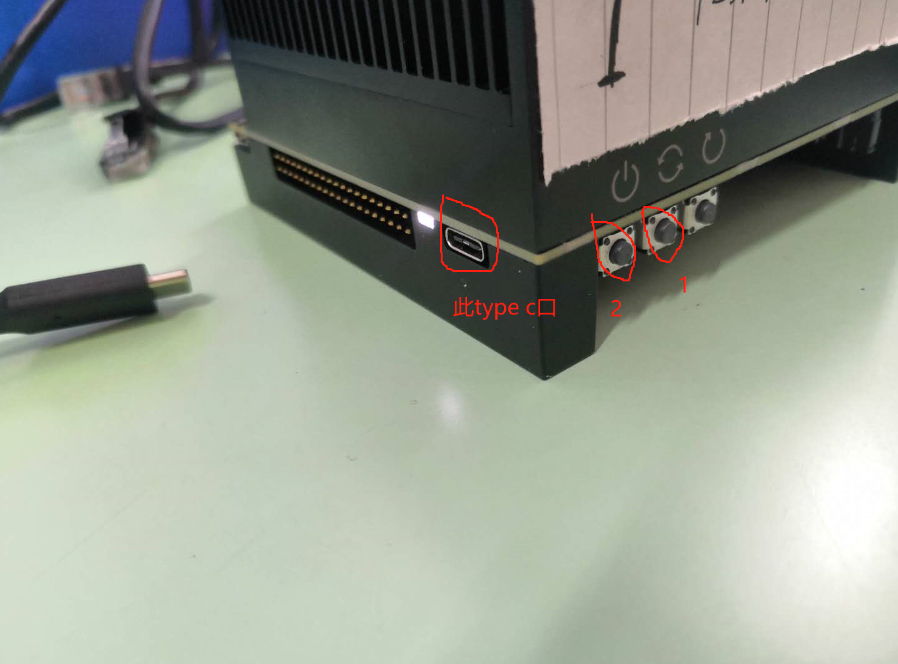

<!--
 * @Author         : Minghang Li
 * @Date           : 2022-11-25 20:42
 * @LastEditTime   : 2022-11-25 22:34
 * @Note           : 
 * @Copyright(c)   : Minghang Li Copyright
-->
# AGX入坑指南
> 前言：最近在帮实验室做项目，用到了Nvidia的AGX Xavier嵌入式开发套件，简单来说就是一个arm架构的计算卡，跟jetson NX、jetson NANO一个德行。但坑就坑在这玩意是arm架构，虽然跑的是Ubuntu，但适配的软件实在是太少，而且好多环境，比如opencv、ros、pytorch什么的都不能按照正常Ubuntu的安装方式去安装，所以就写了这一篇文档，希望饱经折磨的学弟学妹可以少走一点弯路

## 零、刷机

刚拿到手的AGX可能是学长用剩下的，可能是新买的，总之环境配置等可能不如你意，我们需要重新给AGX刷一个系统  

准备一个ubuntu系统，自己电脑用的那种就好，储存空间一定要大于50GB！！！很重要，后面会讲为什么。Ubuntu20.04、18.04、16.04应该都可以刷

首先要从Nvidia官网下载SDK Manager（[点这里](https://developer.nvidia.com/drive/sdk-manager)），选择.deb结尾的包即可  
  

然后进入你的包的下载文件夹，执行

`sudo apt install ./sdkmanager_xxx_amd64.deb` 
安装过程中，需要选择的都选YES或者Enter就好了  

安装完成后，执行 
`sdkmanager` 
这个时候会弹出来一个Nvidia的登陆界面，输入账号密码之后登录
  

这个时候，把你手上的AGX插上电源，点击开机键，就是2号键，再用usbC线把AGX与你的电脑连起来，注意要插到电源线旁边那个口，不然识别不出来，就是这个口：   

AGX上电之后，SDK Manager应该就能探测出来你的设备了，这个时候在步骤二中选择你的设备（NX、AGX、NANO等），系统镜像一般是最新的，应该已经到5.x版本了

>   未完待续.....