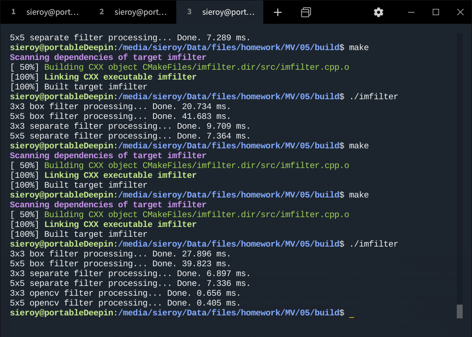

# 机器视觉 - 第五次作业

## 程序

```c++
#include "opencv2/opencv.hpp"
#include <time.h>
#include <iostream>

using namespace cv;
using namespace std;

void uniformFilterBox(Mat& in, Mat& out, int ksize);
void uniformFilterSeparate(Mat& in, Mat& out, int ksize);

int main(){
    Mat inImg, grayImg, filteredBoxImg, filteredSeparateImg, filterCVImg;
    clock_t clockval, clockdiv;

    inImg = imread("../input.png");
    cvtColor(inImg, grayImg, COLOR_RGB2GRAY);

    cout << "3x3 box filter processing...";
    clockval = clock();
    uniformFilterBox(grayImg, filteredBoxImg, 3);
    clockdiv = clock() - clockval;
    cout << " Done. " << clockdiv/1e3 << " ms.\n";
    imwrite("../output_box_3x3.png", filteredBoxImg);

    cout << "5x5 box filter processing...";
    clockval = clock();
    uniformFilterBox(grayImg, filteredBoxImg, 5);
    clockdiv = clock() - clockval;
    cout << " Done. " << clockdiv/1e3 << " ms.\n";
    imwrite("../output_box_5x5.png", filteredBoxImg);

    cout << "3x3 separate filter processing...";
    clockval = clock();
    uniformFilterSeparate(grayImg, filteredSeparateImg, 3);
    clockdiv = clock() - clockval;
    cout << " Done. " << clockdiv/1e3 << " ms.\n";
    imwrite("../output_separate_3x3.png", filteredSeparateImg);
    
    cout << "5x5 separate filter processing...";
    clockval = clock();
    uniformFilterSeparate(grayImg, filteredSeparateImg, 5);
    clockdiv = clock() - clockval;
    cout << " Done. " << clockdiv/1e3 << " ms.\n";
    imwrite("../output_separate_5x5.png", filteredSeparateImg);

    cout << "3x3 opencv filter processing...";
    clockval = clock();
    boxFilter(grayImg, filterCVImg, -1, Size(3,3));
    clockdiv = clock() - clockval;
    cout << " Done. " << clockdiv/1e3 << " ms.\n";
    imwrite("../output_opencv_3x3.png", filterCVImg);

    cout << "5x5 opencv filter processing...";
    clockval = clock();
    boxFilter(grayImg, filterCVImg, -1, Size(5,5));
    clockdiv = clock() - clockval;
    cout << " Done. " << clockdiv/1e3 << " ms.\n";
    imwrite("../output_opencv_5x5.png", filterCVImg);

    return 0;
}

void uniformFilterBox(Mat& in, Mat& out, int ksize){
    if (ksize <= 0 || !(ksize % 2)){
        cout << "Param \'ksize\' should be odd and positive.\n";
        exit(1);
    }
    else{
        int k = ksize-1;
        int w1 = in.cols, w2 = w1-k;
        uint8_t* inImp = in.ptr();
        uint8_t* outImp;
        
        out = out.zeros(in.rows-k, in.cols-k, in.type());
        outImp = out.ptr();

        for(int i=0; i<in.cols-k; ++i){
            for(int j=0; j<in.rows-k; ++j){
                int s = 0;
                for(int m=0; m<ksize; ++m){
                    for(int n=0; n<ksize; ++n){
                        s += inImp[(j+m)*w1+i+n];
                    }
                }
                outImp[j*w2+i] = (uint8_t)(s*1./ksize/ksize);
            }
        }
    }
}

void uniformFilterSeparate(Mat& in, Mat& out, int ksize){
    if (ksize <= 0 || !(ksize % 2)){
        cout << "Param \'ksize\' should be odd and positive.\n";
        exit(1);
    }
    else{
        int k = ksize-1;
        Mat tmp = in.zeros(in.rows-k, in.cols, in.type());
        out = in.zeros(in.rows-k, in.cols-k, in.type());

        uint8_t* inImp = in.ptr();
        uint8_t* tmpImp = tmp.ptr();
        uint8_t* outImp = out.ptr();
        int w1 = in.cols, w2 = tmp.cols, w3 = out.cols;

        for(int i=0; i<in.cols; ++i){
            int s = 0;
            for(int m=0; m<ksize; ++m){
                s += inImp[m*w1+i];
            }
            tmpImp[i] = (uint8_t)(s*1./ksize);
            for(int j=0; j<in.rows-ksize; ++j){
                s -= inImp[j*w1+i];
                s += inImp[(j+ksize)*w1+i];
                tmpImp[(j+1)*w2+i] = (uint8_t)(s*1./ksize);
            }
        }
        
        for(int j=0; j<tmp.rows; ++j){
            int s = 0;
            for(int n=0; n<ksize; ++n){
                s += tmpImp[j*w2+n];
            }
            outImp[j*w3] = (uint8_t)(s*1./ksize);
            for(int i=0; i<tmp.cols-ksize; ++i){
                s -= tmpImp[j*w2+i];
                s += tmpImp[j*w2+i+ksize];
                outImp[j*w3+i+1] = (uint8_t)(s*1./ksize);
            }
        }
    }
}
```

## 输出截图

（当时后台有其他程序，耗时不太稳）



## 输出图像

| 原图(1000x600) | 原图灰度图(1000x600) |
| -------------- |----|
|  |  |

| 3x3盒型滤波(998x598)    | 5x5盒型滤波(996x596)    |
| ----------------------- | ----------------------- |
|  |  |

| 3x3分离滤波(998x598)         | 5x5分离滤波(996x596)         |
| ---------------------------- | ---------------------------- |
|  |  |

| 3x3 OpenCV库函数(1000x600) | 5x5 OpenCV库函数(1000x600) |
| -------------------------- | -------------------------- |
|  |  |

## 分析

- 速度上，使用定义法实现的均值滤波，大大逊色于分离滤波。
- 输出结果上，两种方法没什么区别。
- 而OpenCV的库函数就很厉害了，不仅在速度上大大优于定义法和分离法，而且输出的结果也不会由于滤波而出现边缘缩减的问题。


