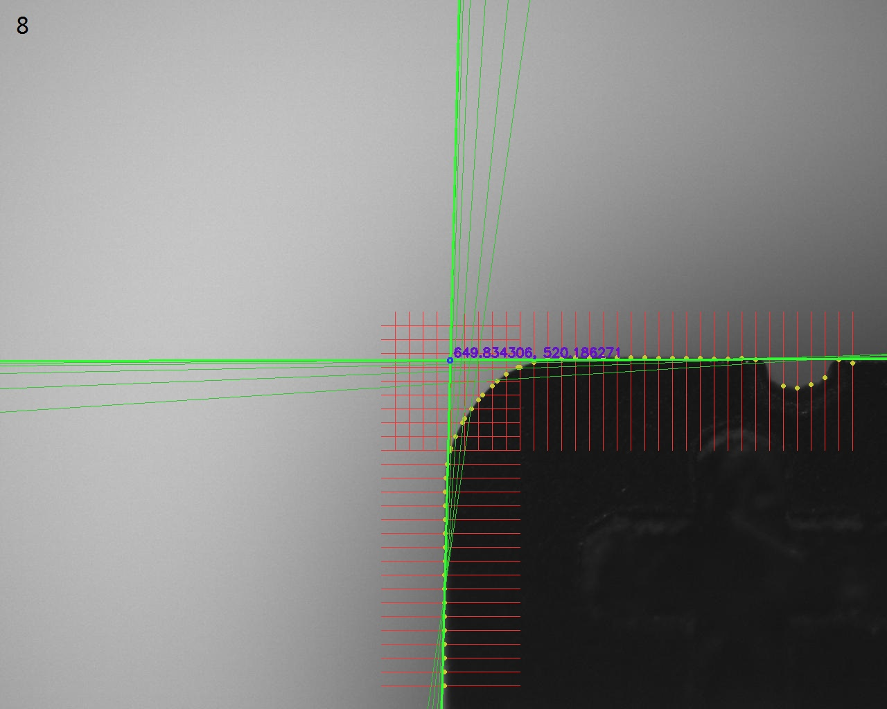

# 机器视觉-第八次作业

## 实现思路

- 观察目标图片们，为两个主要直线区域设置ROI。并观察主要直线，根据它们的倾角设置采样方向。
- 在每条采样线上间隔做差，以近似一阶导数，选其中大于阈值且最大的差值对应的点作为目标边缘像素。
- 对边缘像素进行最小二乘拟合，并根据拟合结果算出各点到直线的距离，利用这个距离来计算出$\varepsilon^2$、并计算点的权重。
- 根据权重，重新拟合，并计算出$\varepsilon^2$、更新权重，若此次计算出的$\varepsilon^2$与上一次$\varepsilon^2$的差值过大，可以认为没有收敛，重复该步。
- 对两条直线拟合完后，计算它们的交点，并绘制出来，输出图片结果。对每个图片，重复。

## 代码

```cpp
#include <vector>
#include <string>
#include "opencv2/opencv.hpp"

using namespace std;
using namespace cv;

#define DIR_HOR 1
#define DIR_VER 2
#define DIV_THRES 15

void findEdgePixel(Mat& img, vector<Point>& points, Mat& canvasimg, Rect& roi, int sampleinterval, int direction);
void fitLineMinSqr(vector<Point>& points, Point3d& linearg, Mat& canvasimg, int weight_thres);
void drawMyLine(Point3d& linearg, Mat& canvasimg, Scalar color, int thick);
void drawCrossPoint(Point3d& line1, Point3d& line2, Mat& canvasimg);

int main(){
    for (int i=5; i<=19; ++i){
        char filename[8];
        sprintf(filename, "%02d.jpg", i);
        Mat img = imread(string("../image/")+filename);
        Mat gray;
        Rect roi1(550, 450, 700, 200), roi2(550, 450, 200, 550);
        vector<Point> points1, points2;
        Point3d line1, line2;

        cvtColor(img, gray, COLOR_BGR2GRAY);

        findEdgePixel(gray, points1, img, roi1, 20, DIR_VER);
        findEdgePixel(gray, points2, img, roi2, 20, DIR_HOR);

        fitLineMinSqr(points1, line1, img, 40);
        fitLineMinSqr(points2, line2, img, 25);

        drawCrossPoint(line1, line2, img);

        imwrite(string("../outimg/out")+filename, img);
    }

    return 0;
}

void findEdgePixel(Mat& img, vector<Point>& points, Mat& canvasimg, Rect& roi, int sampleinterval, int direction){
    if (direction == DIR_HOR){
        Mat partimg;
        uint8_t* pixp;

        GaussianBlur(img(roi), partimg, Size(3,3), 1);
        pixp = partimg.ptr();
        points.clear();
        
        for (int y = sampleinterval; y<roi.height; y+=sampleinterval){
            line(canvasimg, Point(roi.x, roi.y+y), Point(roi.x+roi.width, roi.y+y), Scalar(50,50,250));
            int mx = -1, md = -1;
            for (int x=2, offset=y*roi.width+2; x<roi.width-2; ++x, ++offset){
                int div = abs((int)(pixp[offset+2])-(int)(pixp[offset-2]));
                if (div > DIV_THRES && div > md){
                    mx = x;
                    md = div;
                }
            }
            if (mx>0){
                points.push_back(Point(roi.x+mx, roi.y+y));
                circle(canvasimg, points.back(), 2, Scalar(50,200,200),2);
            }
        }
    }
    else if (direction == DIR_VER){
        Mat partimg;
        uint8_t* pixp;

        GaussianBlur(img(roi), partimg, Size(3,3), 1);
        pixp = partimg.ptr();
        points.clear();
        
        for (int x = sampleinterval; x<roi.width; x+=sampleinterval){
            line(canvasimg, Point(roi.x+x, roi.y), Point(roi.x+x, roi.y+roi.height), Scalar(50,50,250));
            int my = -1, md = -1;
            for (int y=2, offset1=x, offset2=4*roi.width+x; y<roi.height-2; ++y, offset1+=roi.width, offset2+=roi.width){
                int div = abs((int)(pixp[offset2])-(int)(pixp[offset1]));
                if (div > DIV_THRES && div > md){
                    my = y;
                    md = div;
                }
            }
            if (my>0){
                points.push_back(Point(roi.x+x, roi.y+my));
                circle(canvasimg, points.back(), 2, Scalar(50,200,200),2);
            }
        }
    }
}

void fitLineMinSqr(vector<Point>& points, Point3d& linearg, Mat& canvasimg, int weight_thres){
    vector<double> weights;
    for(auto& _:points) weights.push_back(1.0);

    double fit_alpha = 0.0, fit_beta = 0.0, fit_gamma = 0.0;
    double ep2 = 1700010086.0, ep20 = 170001.0;

    do {
        {   // 计算点列的各种矩，进而拟合出直线的alpha beta gamma
            double wsum = 0.0;
            double xsum = 0.0, ysum = 0.0;
            double mu20 = 0.0, mu11 = 0.0, mu02 = 0.0;
            double n10 = 0.0, n01 = 0.0;

            for (int i=0; i<points.size(); ++i){
                double wv = weights[i];
                if (wv == 0.0) continue;
                wsum += weights[i];
                xsum += points[i].x * weights[i];
                ysum += points[i].y * weights[i];
            }
            n10 = xsum/wsum;
            n01 = ysum/wsum;

            for (int i=0; i<points.size(); ++i){
                double wv = weights[i];
                double xd = points[i].x-n10, yd = points[i].y-n01;
                if (wv == 0.0) continue;
                mu20 += xd*xd * wv;
                mu11 += xd*yd * wv;
                mu02 += yd*yd * wv;
            }

            // 特征值
            double smu2 = mu20+mu02;
            double lambda1 = (smu2 - sqrt(smu2*smu2-4*(mu02*mu20-mu11*mu11)))/2;
            double lambda_mu20 = lambda1 - mu20;
            double normden = sqrt(mu11*mu11 + lambda_mu20*lambda_mu20);

            // 特征向量
            fit_alpha = mu11/normden;
            fit_beta = lambda_mu20/normden;
            fit_gamma = -(fit_alpha*n10 + fit_beta*n01);
        }

        {   // 更新权重、计算二乘得分
            ep20 = ep2;
            ep2 = 0.0;
            for (int i=0; i<points.size(); ++i){
                double dist = abs(fit_alpha*points[i].x + fit_beta*points[i].y + fit_gamma);
                ep2 += dist*dist*weights[i];
                weights[i] = dist>weight_thres ? 0.0 : pow(1-dist*dist/weight_thres/weight_thres, 2);
            }
        }
        Point3d tmp(fit_alpha, fit_beta, fit_gamma);
        drawMyLine(tmp, canvasimg, Scalar(50,200,50), 1);

    } while (ep20 - ep2 > 0.1);
    // 拟合基本收敛，结束循环，画出直线，返回结果
    linearg.x = fit_alpha;
    linearg.y = fit_beta;
    linearg.z = fit_gamma;
    drawMyLine(linearg, canvasimg, Scalar(50,250,50), 2);
}

void drawMyLine(Point3d& linearg, Mat& canvasimg, Scalar color, int thick){
    double fit_alpha = linearg.x;
    double fit_beta = linearg.y;
    double fit_gamma = linearg.z;

    Point drawp[2];
    int ind = 0;
    if (fit_alpha > 0.001 || fit_alpha < -0.001){
        int x;
        x = -fit_gamma/fit_alpha;
        if (x>=0 && x<canvasimg.cols){
            drawp[ind].x = x;
            drawp[ind].y = 0;
            if (++ind >= 2) goto DRAW;
        }
        x = -(fit_gamma+fit_beta*(canvasimg.rows-1))/fit_alpha;
        if (x>=0 && x<canvasimg.cols){
            drawp[ind].x = x;
            drawp[ind].y = canvasimg.rows-1;
            if (++ind >= 2) goto DRAW;
        }
    }
    if (fit_beta > 0.001 || fit_beta < -0.001){
        int y;
        y = -fit_gamma/fit_beta;
        if (y>=0 && y<canvasimg.rows){
            drawp[ind].x = 0;
            drawp[ind].y = y;
            if (++ind >= 2) goto DRAW;
        }
        y = -(fit_gamma+fit_alpha*(canvasimg.cols-1))/fit_beta;
        if (y>=0 && y<canvasimg.rows){
            drawp[ind].x = canvasimg.cols-1;
            drawp[ind].y = y;
            if (++ind >= 2) goto DRAW;
        }
    }
    return ;
    DRAW:
    line(canvasimg, drawp[0], drawp[1], color, thick);
}

void drawCrossPoint(Point3d& line1, Point3d& line2, Mat& canvasimg){
    double y = (line2.z/line2.x-line1.z/line1.x)/(line1.y/line1.x-line2.y/line2.x);
    double x = -(line1.y*y+line1.z)/line1.x;
    circle(canvasimg, Point(x,y), 3, Scalar(250,50,50), 2);
    putText(canvasimg, to_string(x)+", "+to_string(y), Point(x+5,y-5), FONT_HERSHEY_SIMPLEX, 0.6, Scalar(200,20,100), 2);
}

```

## 结果图





（可以减小阈值，以增加迭代次数，使结果更好一些。但已经可以明显看出较好的拟合效果了。）